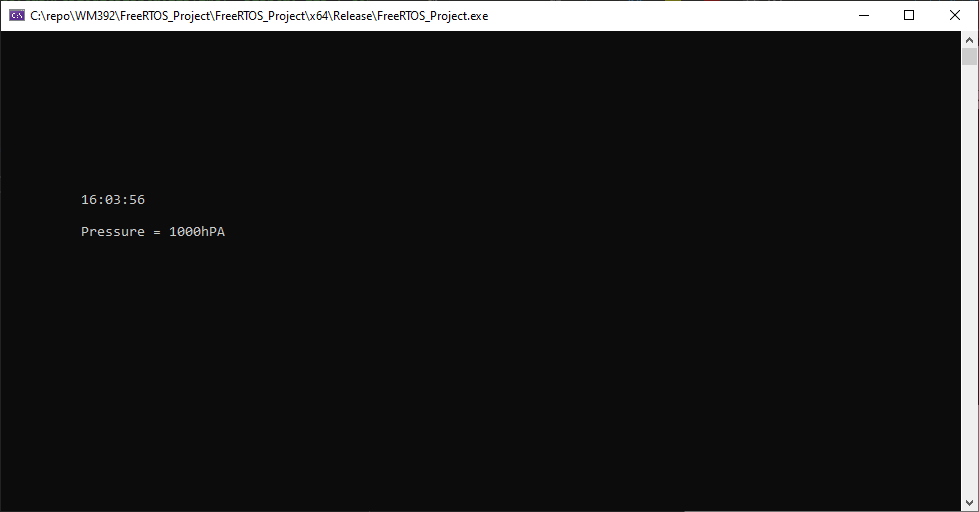
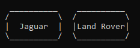
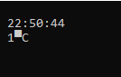
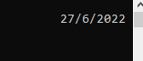
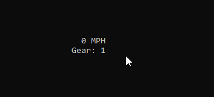
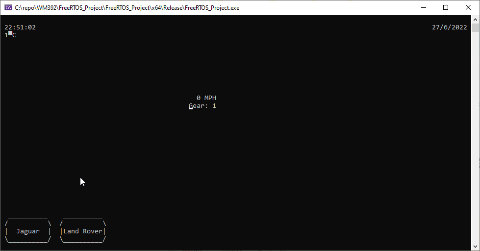

\newpage

# Abstract
The purpose of this document is to showcase and explain the logic behind the source code for WM392 Assigment 2. Part 1 contains all source code for Missions 1-3 and their explanations. Part 2 contains source code, system diagrams, and code analysis for a real-time digital dashboard from a vehicle. All code is implemented using C and FreeRTOS [@freertos_2022].

GitHub Repository: https://github.com/jaxkyoung/WM392_Assignment_2

\newpage

# Part 1
## Introduction
Mr. William, and his team are newly developing the Real-Time Environment Sensing Module-392 (RTESM-392) which displays real-time environment data such as humidity, temperature and pressure. The predecessor module (RTESM-100) was expensive because various sensors were attached to collect humidity, temperature, and pressure data. For this reason, his company wants to develop RTESM-392 module which enables collection of various environmental data points from the Real-Time Environment Sensing Server (RTESS). The code within the missions implements a viable solution for Mr. William.

## Mission 1
### MVP
Using the `<time.h>`{.c} library, the current time and date since 1/1/1900 can be returned using `time()`{.c}. The using the `localtime_s()`{.c} function and saves it into the struct `day_time`{.c}.

In the task below, no semaphores or mutexes have been used. It is not necessary to use one as the time shared variable is only written to in one task, which therefore does not yield any data inconsistencies.

```c
void taskCalculateDateTime(void* pvParameters) {
    // initialise t variable of time type
    time_t t;
    // infinite loop
    while (1) {
        // get time once every second
        time(&t);
        // calculate local time and save to day time global struct
        localtime_s(&day_time, &t);
        // delay
        vTaskDelay(1000 / portTICK_PERIOD_MS);
    }
}
```

For each task that uses the `printXY()`{.c} function, a `temp`{.c} char array is definied to store the string being printed. An infinite loop is executed to continuously print the time to the user screen. `sprintf_s`{.c} is used to create a string a store it in the `temp`{.c} variable. Each element of time is accessed from the global `day_time`{.c} struct. Finally `vTaskDelay()`{.c} is used to ensure the task is executed once every second. 

```c
void taskPeriodicDisplayTime(void* pvParameters) {
    // initialise char array to display time
    char temp[256];
    // infinite loop
    while (1) {
        // create string to print to screen, get hour, minute, 
		// and second and print with 2 sig figs
        sprintf_s(temp, 255, "%02d:%02d:%02d\n", day_time.tm_hour, 
					day_time.tm_min, day_time.tm_sec);
        // print to (10,10)
        printXY(10, 10, temp);
        // delay
        vTaskDelay(1000 / portTICK_PERIOD_MS);
    }
    vTaskDelete(tkHandler1);
}
```

The date is displayed for two seconds every minute upon completion of every minute. The structure of the task follows the same as the previous tasks. By using an `if...else`{.c} selection statement to check if `day_time.tm_sec == 0`{.c} the application then forms a string using the same method as before to show the date for two seconds and then prints over the same location with an empty string after two seconds have elapsed. 

```c
void taskPeriodicDisplayDate(void* pvParameters) {
	// initialise char array to display date
	char temp[256];
	// infinite loop
	while (1) {
		// if seconds == 00 then print date
		if (day_time.tm_sec == 0) {
			// create string to print to screen, get day, month and add 1 as it runs 
			// 0-11 not 1-12 and get year but add 1900 as it calculates years since then
			sprintf_s(temp, 255, "%d/%d/%d\n", day_time.tm_mday, 
					day_time.tm_mon + 1, day_time.tm_year + 1900);
			// print to (10,11)
			printXY(10, 11, temp);
			// wait 2 seconds
			vTaskDelay(2000 / portTICK_PERIOD_MS);
			// print empty string to (10,11) to clear date
			sprintf_s(temp, 255, "                          \n");
			printXY(10, 11, temp);
		}
	}
}
```


\newpage

### LED Extra
The below multi-dimensional array is used to store the mapping from a digit to segments of a 7 segment display. The `popDigit`{.c} function takes two parameters `digit`{.c} and `position`{.c}; where digit and position are the digit to be converted and the position to be placed in the LED display from 1 to 6 respectively.

```c
// mapping for number to segments of display
const int digits[10][7] = {
	//    A, B, C, D, E, F, G
	/**/{ 1, 1, 1, 1, 1, 0, 0 },
		{ 0, 1, 1, 0, 0, 0, 0 },
		{ 1, 1, 0, 1, 1, 0, 1 },
		{ 1, 1, 1, 1, 0, 0, 1 },
		{ 0, 1, 1, 0, 0, 1, 1 },
		{ 1, 0, 1, 1, 0, 1, 1 },
		{ 1, 0, 1, 1, 1, 1, 1 },
		{ 1, 1, 1, 0, 0, 0, 0 },
		{ 1, 1, 1, 1, 1, 1, 1 },
		{ 1, 1, 1, 1, 0, 1, 1 }
};
```

The code below uses a for loop and the parameter `digit`{.c} to convert the chosen digit into a character array using the `digits`{.c} map that is defined above. 

```c
// define char array to show LED digits
char digit1[3][256] = { ' ' };
char digit2[3][256] = { ' ' };
char digit3[3][256] = { ' ' };
char digit4[3][256] = { ' ' };
char digit5[3][256] = { ' ' };
char digit6[3][256] = { ' ' };

void popDigit(int digit, int position) {
	// define output char array
	char out[3][256] = { ' ' };
	// for each segment
	for (int i = 0; i < 7; i++) {
		// check if requested digit needs the selected segment
		if (digits[digit][i] == 1) /* Has digit the i segment? */
			switch (i) {
			// fill positions in out char array
			case 0: out[0][1] = '_'; break; //A
			case 1: out[1][2] = '|'; break; //B
			case 2: out[2][2] = '|'; break; //C
			case 3: out[2][1] = '_'; break; //D
			case 4: out[2][0] = '|'; break; //E
			case 5: out[1][0] = '|'; break; //F
			case 6: out[1][1] = '_'; break; //G
			}
	}
```

Using the parameter `position`{.c}, the converted char array is copied to the corresponding LED digit depending on what position was selected. The `popDigit()`{.c} function is then used in the task below the snippet below.

```c
	// check position requested and fill corresponding digit array
	switch (position) {
		// if position
		case 1:
			// for each line in the out char array copy into the digit array 
			for (int i = 0; i < 3; i++) {
				strcpy(digit1[i], out[i]);
			}
			break;
		// if position
		case 2:
			// for each line in the out char array copy into the digit array 
			for (int i = 0; i < 3; i++) {
				strcpy(digit2[i], out[i]);
			}
			break;
		// if position
		case 3:
			// for each line in the out char array copy into the digit array 
			for (int i = 0; i < 3; i++) {
				strcpy(digit3[i], out[i]);
			}
			break;
		// if position
		case 4:
			// for each line in the out char array copy into the digit array 
			for (int i = 0; i < 3; i++) {
				strcpy(digit4[i], out[i]);
			}
			break;
		// if position
		case 5:
			// for each line in the out char array copy into the digit array 
			for (int i = 0; i < 3; i++) {
				strcpy(digit5[i], out[i]);
			}
			break;
		// if position
		case 6:
			// for each line in the out char array copy into the digit array 
			for (int i = 0; i < 3; i++) {
				strcpy(digit6[i], out[i]);
			}
			break;
	}
}
```

The task below uses data from the `day_time`{.c} struct and the `popDigit()`{.c} function to display the time in an LED format once every second. Each iteration, the digits are cleared and recalculated using `popDigit()`{.c}.

```c
void taskPeriodicDisplayLEDTime(void* pvParameter) {
	// define padding char array
	char padding[256];
	// print a line of underscores to surround the LED display
	// this only needs to be printed once
	sprintf_s(padding, 255, "______________________________\n");
	printXY(10, 5, padding);
	printXY(10, 9, padding);
	// infinite loop
	while (1) {
		// empty output digits char array
		for (int i = 0; i < 3; i++) {
			for (int j = 0; j < 200; j++) {
				digit1[i][j] = ' ';
				digit2[i][j] = ' ';
				digit3[i][j] = ' ';
				digit4[i][j] = ' ';
				digit5[i][j] = ' ';
				digit6[i][j] = ' ';
			}
		}
		// get single digits from current time
		int hourDig1;
		hourDig1 = day_time.tm_hour / 10;
		// populate LED digit with the digit from above and put it in the correct position
		// for this example, it is the first hour digit so would be position 1/6
		// repeat this process for the rest of the digits
		popDigit(hourDig1, 1);
		int hourDig2;
		hourDig2 = day_time.tm_hour % 10;
		popDigit(hourDig2, 2);
		int minDig1;
		minDig1 = day_time.tm_min / 10;
		popDigit(minDig1, 3);
		int minDig2;
		minDig2 = day_time.tm_min % 10;
		popDigit(minDig2, 4);
		int secDig1;
		secDig1 = day_time.tm_sec / 10;
		popDigit(secDig1, 5);
		int secDig2;
		secDig2 = day_time.tm_sec % 10;
		popDigit(secDig2, 6);
```

Used in conjunction with the `popDigit()`{.c} function the above task displays 6 multi-dimensional character arrays which contain the a combination of '|' and '_' to display digits in the form of a segmented display. Using `printXY()`{.c} the application can strategically place the digits to display side by side and mimic and LED clock. 

```c
		// print the digits to the screen, 
		// i.e. position 0,1, and 2 of the digit char arrays
		printXY(10, 6, digit1[0]);
		printXY(10, 7, digit1[1]);
		printXY(10, 8, digit1[2]);
		printXY(13, 6, digit2[0]);
		printXY(13, 7, digit2[1]);
		printXY(13, 8, digit2[2]);
		// print gap between hour and minute
		printXY(16, 7, "-");
		printXY(16, 8, "-");
		printXY(17, 6, digit3[0]);
		printXY(17, 7, digit3[1]);
		printXY(17, 8, digit3[2]);
		printXY(20, 6, digit4[0]);
		printXY(20, 7, digit4[1]);
		printXY(20, 8, digit4[2]);
		// print gap between minute and second
		printXY(23, 7, "-");
		printXY(23, 8, "-");
		printXY(24, 6, digit5[0]);
		printXY(24, 7, digit5[1]);
		printXY(24, 8, digit5[2]);
		printXY(27, 6, digit6[0]);
		printXY(27, 7, digit6[1]);
		printXY(27, 8, digit6[2]);
		// delay 1 second
		vTaskDelay(1000 / portTICK_PERIOD_MS);
	}
}
```


\newpage

## Mission 2
### MVP
#### Periodic Display of Temperature
For the MVP (Minimum Viable Product) implementation, the app uses a random number generator to get values for temperature, pressure, and humidity. Using `rand() % X`{.c} we can get a random number between 0 and `X`{.c}. In the case of pressure, we have offset the value by 900 to give a realistic value.

```c
int currentTemp;
int currentPressure;
int currentHumidity;

void taskGetWeather(void* pvParameter) {
    // infinite loop
    while (1) {
        // current temp = random int between 0 and 40
        currentTemp = rand() % 40;
        // current pressure is random int between 900 and 1200
        currentPressure = 900 + rand() % 300;
        // current humidity is random int between 0 and 100
        currentHumidity = rand() % 100;
    }
}
```

To display the temperature periodically, the app follows the same template of creating a temporary char array and initialising an infinite loop. It then checks that the second value is equal to 10 and then prints the temperature to the display, below the date position, for 2 seconds.

```c
void taskPeriodicDisplayTemp(void* pvParameters) {
    // init char array
    char temp[256];
    // infinite loop
    while (1) {
        // if seconds == 10 then display temp
        if (day_time.tm_sec == 10) {
            sprintf_s(temp, 255, "Temp = %d%cC\n", currentTemp, 223);
            printXY(10, 12, temp);
            // wait 2 seconds
            vTaskDelay(2000 / portTICK_PERIOD_MS);
            sprintf_s(temp, 255, "                          \n");
            printXY(10, 12, temp);
        }
    }
}
```


\newpage

#### Periodic Display of Pressure
```c
void taskPeriodicDisplayPressure(void* pvParameters) {
    // init char array
    char temp[256];
    // infinite loop
    while (1) {
        // if seconds == 50 then display pressure
        if (day_time.tm_sec == 50) {
            sprintf_s(temp, 255, "Pressure = %dhPA\n", currentPressure);
            printXY(10, 12, temp);
            // wait 2 seconds
            vTaskDelay(2000 / portTICK_PERIOD_MS);
            sprintf_s(temp, 255, "                          \n");
            printXY(10, 12, temp);
        }
    }
}
```
To display the pressure periodically, the app follows the code as for temperature.


\newpage

#### Periodic Display of Humidity
```c
void taskPeriodicDisplayHumidity(void* pvParameters) {
    // init char array
    char temp[256];
    // infinite loop
    while (1) {
        // if seconds == 30 then display humidity
        if (day_time.tm_sec == 30) {
            sprintf_s(temp, 255, "Humidity = %d%%\n", currentHumidity);
            printXY(10, 12, temp);
            // wait 2 seconds
            vTaskDelay(2000 / portTICK_PERIOD_MS);
            sprintf_s(temp, 255, "                          \n");
            printXY(10, 12, temp);
        }
    }
}
```

To display the pressure humidity, the app follows the code as for temperature and pressure.


\newpage

### OpenWeatherMap API
Using the libcurl library, the application can access the OpenWeatherMap API that has been created using their web service. It returns current weather data for the location given, in this case it is for Warwick. Finally we create `CURLcode`{.c} object to store the XML/JSON data returned from the API call to then extract later on to be used in the displayed of weather data.

```c
void taskGetAPIWeather(void* pvParameters) {
    CURL* hnd = curl_easy_init();

    curl_easy_setopt(hnd, CURLOPT_CUSTOMREQUEST, "GET");
    curl_easy_setopt(hnd, CURLOPT_URL, 
	"https://community-open-weather-map.p.rapidapi.com/weather?");

    struct curl_slist* headers = NULL;
    headers = curl_slist_append(headers, 
		"X-RapidAPI-Host: community-open-weather-map.p.rapidapi.com");
    headers = curl_slist_append(headers, 
		"X-RapidAPI-Key: 2172abc47bmshadab69c37af5e1ap181d88jsnb47e5db0a501");
    curl_easy_setopt(hnd, CURLOPT_HTTPHEADER, headers);

    CURLcode ret = curl_easy_perform(hnd);
    curl_easy_cleanup(hnd);
}
```

\newpage

## Mission 3
Using a temp char array again, the application will print out either the temperature, humidity or pressure, on demand. Using the `getch()`{.c} function, the application can monitor user keystrokes without the need for enter being pressed and can act accordingly when a key is pressed. In this case we look for 't', 'T', 'h', 'H', 'p', and 'P' and respond with the corresponding weather metric and display it for 2 seconds. 

```c
void taskEventManualDisplay(void* pvParameters) {
    // init char array to display the chosen metric
    char temp[256];
    // command variable to be input by user using keyboard T H or P
    int command;
    // infinite loop
    while (1) {
        // get input from user
        command = getch();
        // switch case statement - from T, H, P
        switch (command) {
        case 'T':
        case 't':
            // if T, then print currentTemp for 2 seconds
            sprintf_s(temp, 255, "Temp = %d%cC\n", currentTemp, 223);
            printXY(10, 12, temp);
            vTaskDelay(2000 / portTICK_PERIOD_MS);
            sprintf_s(temp, 255, "                          \n");
            printXY(10, 12, temp);
            break;
        case 'H':
        case 'h':
            // if H, then print currentHumidity for 2 seconds
            sprintf_s(temp, 255, "Humidity = %d%%\n", currentHumidity);
            printXY(10, 12, temp);
            vTaskDelay(2000 / portTICK_PERIOD_MS);
            sprintf_s(temp, 255, "                          \n");
            printXY(10, 12, temp);
            break;
        case 'P':
        case 'p':
            // if P, then print currentPRessure for 2 seconds
            sprintf_s(temp, 255, "Pressure = %dhPA\n", currentPressure);
            printXY(10, 12, temp);
            vTaskDelay(2000 / portTICK_PERIOD_MS);
            sprintf_s(temp, 255, "                          \n");
            printXY(10, 12, temp);
            break;
        }
    }
}
```

\newpage




\newpage

## Main Function
The main function contains numerous calls to `xTaskCreate()`{.c}. Each call links each function that is created in the file to a task in the OS and then allows the scheduler to allocate CPU time to it. Each task has the same priority, and the manual display tasks will take priority when a key is pressed.

```c
int main(void) {
    xTaskCreate(taskPeriodicDisplayLEDTime, "Display_LED", 
		configMINIMAL_STACK_SIZE, NULL, tskIDLE_PRIORITY, NULL);
    xTaskCreate(taskGetRandomWeather, "Get_Weather", 
		configMINIMAL_STACK_SIZE, NULL, tskIDLE_PRIORITY, NULL);
    xTaskCreate(taskCalculateDateTime, "Calc_Date_Time", 
		configMINIMAL_STACK_SIZE, NULL, tskIDLE_PRIORITY, NULL);
    xTaskCreate(taskPeriodicDisplayTime, "Display_Time", 
		configMINIMAL_STACK_SIZE, NULL, tskIDLE_PRIORITY, &tkHandler1);
    xTaskCreate(taskPeriodicDisplayDate, "Display_Date", 
		configMINIMAL_STACK_SIZE, NULL, tskIDLE_PRIORITY, NULL);
    xTaskCreate(taskPeriodicDisplayTemp, "Display_Temp", 
		configMINIMAL_STACK_SIZE, NULL, tskIDLE_PRIORITY, NULL);
    xTaskCreate(taskPeriodicDisplayHumidity, "Display_Humidity", 
		configMINIMAL_STACK_SIZE, NULL, tskIDLE_PRIORITY, NULL);
    xTaskCreate(taskPeriodicDisplayPressure, "Display_Pressure", 
		configMINIMAL_STACK_SIZE, NULL, tskIDLE_PRIORITY, NULL);
    xTaskCreate(taskEventManualDisplay, "Display_Pressure", 
		configMINIMAL_STACK_SIZE, NULL, tskIDLE_PRIORITY, NULL);
    vTaskStartScheduler();
    for (;;);
}
```
## Demo
In the assignment submission please find `Part1.mp4` for a video demo of the final product.

\newpage

# Part 2
## Description
The purpose of this application is to emulate a vehicle dashboard showing vehicle speed, ambient temperature, vehicle mileage, and changing of gear. When changing from accelerating past 10, 30, 40, 50, 60 and 70 MPH, the application shall increment the gear and display that to the user. The reverse shall happen during deceleration. 

When no key is being pressed, the application shall simulate engine breaking, and reduce speed automatically. 

The application shall comprise itself of the following:

- 12 Tasks
	- 1 Event Driven
	- 11 Periodic
- 2 Protected Race Conditions 
	- 1 Using Semaphores
	- 1 Using Suspension Of Tasks
- Simulated 3rd Party Data

\newpage

## Code Analysis
### Logo Display
```c
// char arrays to display logos
char line0[256] = { ' ', '_', '_', '_', '_', '_', '_', '_', '_', '_', '_', ' ', ' ', ' ', ' ' };
char line1[256] = { '/', ' ', ' ', ' ', ' ', ' ', ' ', ' ', ' ', ' ', ' ', '\\', ' ', ' ', ' ' };
char line2[256] = { '|', ' ', ' ', 'J', 'a', 'g', 'u', 'a', 'r', ' ', ' ', '|', ' ', ' ', ' ', ' ' };
char line3[256] = { '\\', '_', '_', '_', '_', '_', '_', '_', '_', '_', '_', '/', ' ', ' ', ' ' };

char line4[256] = { ' ', '_', '_', '_', '_', '_', '_', '_', '_', '_', '_', ' ', ' ', ' ', ' ' };
char line5[256] = { '/', ' ', ' ', ' ', ' ', ' ', ' ', ' ', ' ', ' ', ' ', '\\', ' ', ' ', ' ' };
char line6[256] = { '|', 'L', 'a', 'n', 'd', ' ', 'R', 'o', 'v', 'e', 'r', '|', ' ', ' ', ' ', ' ' };
char line7[256] = { '\\', '_', '_', '_', '_', '_', '_', '_', '_', '_', '_', '/', ' ', ' ', ' ' };
```

Below is an example of what is shown when the char arrays are aligned and printed to the command line interface.



### Global Variables
Below are the global/shared variables that are used throughout the program that allow the program's tasks to access important data.
```c
// global variables
struct tm day_time;
int currentTemp;
int currentSpeed;
int currentPressure;
int currentHumidity
int command;
```
\newpage

### Weather Calculation & Display
The code below is used to randomly generate integers within certain bounds to then be assigned to temperature, pressure, and humidity. For the application implementation, the app uses a random number generator to get values for temperature, pressure, and humidity. Using `rand() % X`{.c} we can get a random number between 0 and `X`{.c}. In the case of pressure, we have offset the value by 900 to give a realistic value.

```c
void taskGeRandomtWeather(void* pvParameter) {
	// infinite loop
	while (1) {
		// current temp = random int between 0 and 40
		currentTemp = rand() % 40;
		// current pressure is random int between 900 and 1200
		currentPressure = 900 + rand() % 300;
		// current humidity is random int between 0 and 100
		currentHumidity = rand() % 100;
	}
}
```

The code snippet below, can be used in place of the code above to get real-time weather data from an API. Using the libcurl library, the application can access the OpenWeatherMap API that has been created using their web service. It returns current weather data for the location given, in this case it is for Warwick. Finally we create `CURLcode`{.c} object to store the XML/JSON data returned from the API call to then extract later on to be used in the displayed of weather data.

```c
void taskGetAPIWeather(void* pvParameters) {
    CURL* hnd = curl_easy_init();

    curl_easy_setopt(hnd, CURLOPT_CUSTOMREQUEST, "GET");
    curl_easy_setopt(hnd, CURLOPT_URL, 
	"https://community-open-weather-map.p.rapidapi.com/weather?");

    struct curl_slist* headers = NULL;
    headers = curl_slist_append(headers, 
		"X-RapidAPI-Host: community-open-weather-map.p.rapidapi.com");
    headers = curl_slist_append(headers, 
		"X-RapidAPI-Key: 2172abc47bmshadab69c37af5e1ap181d88jsnb47e5db0a501");
    curl_easy_setopt(hnd, CURLOPT_HTTPHEADER, headers);

    CURLcode ret = curl_easy_perform(hnd);
    curl_easy_cleanup(hnd);
}
```

To display the temperature periodically, the app follows the same template of creating a temporary char array and initialising an infinite loop. It then prints the temperature to the top left corner of the screen. I use the ASCII Char of 223 to show the degree symbol. Unfortunately this does not render in a command line interface.

```c
void taskPeriodicDisplayTemp(void* pvParameters) {
	// init char array
	char temp[256];
	// infinite loop
	while (1) {
		sprintf_s(temp, 255, "%d%cC   \n", currentTemp, 223);
		printXY(1, 2, temp);
		vTaskDelay(1000 / portTICK_PERIOD_MS);
	}
}
```



### Date/Time Display
Using the `<time.h>`{.c} library, the current time and date since 1/1/1900 can be returned using `time()`{.c}. The using the `localtime_s()`{.c} function and saves it into the struct `day_time`{.c}.

```c
void taskCalculateDateTime(void* pvParameters) {
	// initialise t variable of time type
	time_t t;
	// infinite loop
	while (1) {
		// get time once every second
		time(&t);
		// calculate local time and save to day time global struct
		localtime_s(&day_time, &t);
		// delay
		vTaskDelay(1000 / portTICK_PERIOD_MS);
	}
}
```

For each task that uses the `printXY()`{.c} function, a `temp`{.c} char array is definied to store the string being printed. An infinite loop is executed to continuously print the time to the user screen. `sprintf_s`{.c} is used to create a string a store it in the `temp`{.c} variable. Each element of time is accessed from the global `day_time`{.c} struct. Finally `vTaskDelay()`{.c} is used to ensure the task is executed once every second. 

```c
void taskPeriodicDisplayTime(void* pvParameters) {
	// initialise char array to display time
	char temp[256];
	// infinite loop
	while (1) {
		// create string to print to screen, get hour, minute, 
		//and second and print with 2 sig figs
		sprintf_s(temp, 255, "%02d:%02d:%02d\n", day_time.tm_hour, 
			day_time.tm_min, day_time.tm_sec);
		// print to (10,10)
		printXY(1, 1, temp);
		// delay
		vTaskDelay(1000 / portTICK_PERIOD_MS);
	}
	vTaskDelete(tkHandler1);
}
```


The date is displayed constantly. The structure of the task follows the same as the previous tasks. By using an `if...else`{.c} selection statement to check if `day_time.tm_sec == 0`{.c} the application then forms a string using the same method as before to show the date.

```c
void taskPeriodicDisplayDate(void* pvParameters) {
	// initialise char array to display date
	char temp[256];
	// infinite loop
	while (1) {
		// create string to print to screen, get day, month and 
		// add 1 as it runs 0-11 not 1-12 and 
		// get year but add 1900 as it calculates years since then
		sprintf_s(temp, 255, "%d/%d/%d\n", day_time.tm_mday, 
			day_time.tm_mon + 1, day_time.tm_year + 1900);
		// print to (10,11)
		printXY(110, 1, temp);
		vTaskDelay(1000 / portTICK_PERIOD_MS);
	}
}
```



### Speed Control (Event & Periodic)
The speed is controlled using the 'W' and 'S' keys in the same manner you would an online game. 'W' increases speed, while 'S' decreases speed. If no key is pressed then the speed is decreased as if you have let off the throttle.

The task below initialises an infinite loop and immediately checks that there is no pending command. If there isn't, the operating system check if the semphore exists and that the speed is greater than 0 (as a car cannot be going negative speed). The program then takes the semaphore, decrements speed, and finally returns the semaphore. The use of a semaphore prevents a race condition and allows both tasks access to the shared resource while ensuring data integrity following ACID (Atomic, Consistent, Isolated, Durable) tests.

```c
// function to simulate engine braking i.e. speed decreasing when not on accelerator
void taskSimEngineBraking(void* pvParameters) {
	while (1) {
		if (command == 0) { 
			// if there is no user input
			if (speedSemaphore != NULL && currentSpeed > 0) {
				// if semaphore exists and current speed is greater than 0
				/* See if we can obtain the semaphore.  If the semaphore is not
				available wait 10 ticks to see if it becomes free. */
				if (xSemaphoreTake(speedSemaphore, (TickType_t)500) == pdTRUE) {
					// decrement speed
					currentSpeed--;
					// return semaphore
					xSemaphoreGive(speedSemaphore);
				}
				else {
					/* We could not obtain the semaphore and can therefore not access
					the shared resource safely. */
					// return semaphore
					xSemaphoreGive(speedSemaphore);
				}
			}
		}
		// delay task
		vTaskDelay(350 / portTICK_PERIOD_MS);
	}
}
```

The task below is an event driven task. It intialises an infinite loop and immediately gets the user input using the `getch()`{.c} function. The application can monitor user keystrokes without the need for enter being pressed and can act accordingly when a key is pressed. if the command variable receives 'w' then the speed incrementing is executed. Firstly the program check that the semaphore exists and then attempts to take the semaphore. If successful, then the program increments the currentSpeed and then returns the semaphore and resets the command input. The use of a semaphore prevents a race condition and allows both tasks access to the shared resource while ensuring data integrity following ACID (Atomic, Consistent, Isolated, Durable) tests.

When the program receives an 's' input then same code is executed with the difference of decrementing the current speed.

The whole task is delayed by 100ms to avoid excessive acceleration.

```c
void taskEventManualSpeed(void* pvParameters) {
	// init char array to display the chosen metric
	// infinite loop
	while (1) {
		// get input from user
		command = getch();
		// if commmand is to accelerate
		if (command == 'w') {
			if (speedSemaphore != NULL) {
				/* See if we can obtain the semaphore.  If the semaphore is not
				available wait 10 ticks to see if it becomes free. */
				if (xSemaphoreTake(speedSemaphore, (TickType_t)100) == pdTRUE) {
					// increment speed
					currentSpeed++;
					// return semaphore
					xSemaphoreGive(speedSemaphore);
					// reset command
					command = 0;
				}
				else {
					/* We could not obtain the semaphore and can therefore not access
					the shared resource safely. */
					// reset command
					command = 0;
					// return semaphore
					xSemaphoreGive(speedSemaphore);
				}
			}
		}
		// if command is decelerate
		else if (command == 's' && currentSpeed > 0) {
			if (speedSemaphore != NULL) {
				/* See if we can obtain the semaphore.  If the semaphore is not
				available wait 10 ticks to see if it becomes free. */
				if (xSemaphoreTake(speedSemaphore, (TickType_t)100) == pdTRUE) {
					// decrement speed
					currentSpeed--;
					// return semaphore
					xSemaphoreGive(speedSemaphore);
					// reset command
					command = 0;
				}
				else {
					/* We could not obtain the semaphore and can therefore not access
					the shared resource safely. */
					// reset command
					command = 0;
					// return semaphore
					xSemaphoreGive(speedSemaphore);
				}
			}
		}
		else {
			command = 0;
		}
		vTaskDelay(100 / portTICK_PERIOD_MS);
	}
}
```

The task below shall periodically display the speed using the same format as all other 'Display' tasks. This task is delayed by 100ms to account for the rate that speed can be increased. 

```c
void taskDisplaySpeed(void* pvParameters) {
	// task to display speed
	// temp char array
	char temp[256];
	while (1) {
		// continuously display speed from shared resource currentSpeed
		sprintf_s(temp, 255, "%d MPH   \n", currentSpeed);
		printXY(50, 10, temp);
		vTaskDelay(100 / portTICK_PERIOD_MS);
	}
}
```



### Gear Change Processing

The task below is used to inform the choice of gear in the `taskGearChange`{.c} task. The application uses a basic maths equation of $v-u/t$. `rateOfChange`{.c} is used as a global variable to share the data between tasks.

```c
// task to calculate acceleration
void taskCalculateAcceleration(void* pvParameters) {
	// initialise variables
	float previous = 0;
	float current = 0;
	//int rateOfChange;
	while (1) {
		// previous always equals the current
		previous = current;
		// get a new current so old current is previous
		current = currentSpeed;
		// find difference and divide to get rateofchange
		rateOfChange = (current - previous) / 10;
		// delay
		vTaskDelay(500 / portTICK_PERIOD_MS);
	}
}
```

The task below houses all processing for changing gears at a given speed. If the speed reaches a certain speed then the gear shall either be incremented or decremented. Using `rateOfChange`{.c} the program can see if the car is accelerating or decelerating and then choose the next gear based on that. When the next gear has been chosen, the tasks that manipulate speed must be suspended to stop accelerating and decelerating (as a car would when the clutch is disengaged). When the gear is changed the user is notified using `Gear -> Next Gear`{.c} displayed on the command line interface and shown for 500ms. Following that, the new gear is shown and currentSpeed is incremented or decremented to stop the gear being changed accidentally a second time. The tasks are then resumed.

```c
void taskGearChange(void* pvParameters) {
	// temp char
	char temp[256];
	while (1) {
		// if speed equals a threshold to change gear
		if (currentSpeed == 10 || currentSpeed == 30 || currentSpeed == 40 || 
			currentSpeed == 50 || currentSpeed == 60 || currentSpeed == 70) {
			// if speed is increasing 
			if (rateOfChange > 0) {
				// set suggestedgear to current + 1
				nextGear = currentGear + 1;
			}
			// if speed is decreasing
			else if (rateOfChange < 0) {
				// set suggested gear to current - 1
				nextGear = currentGear - 1;
			}
			// suspend manual speed, auto speed and gear display
			// this is due to delay of changing gear
			vTaskSuspend(manualSpeedHandler);
			vTaskSuspend(autoSpeedHandler);
			vTaskSuspend(gearDisplayHandler);
			// create string to display gear change
			sprintf_s(temp, 255, "Gear: %d -> %d\n", currentGear, nextGear);
			currentGear = nextGear;
			printXY(48, 11, temp);
			vTaskDelay(500 / portTICK_PERIOD_MS);
			// if was accelerating then increment speed by 1 so gear is only changed once
			if (rateOfChange > 0) {
				currentSpeed++;
			}
			// if was decelerating then decrement speed by 1 so gear is only changed once
			else if (rateOfChange < 0) {
				currentSpeed--;
			}
			// resume tasks
			vTaskResume(manualSpeedHandler);
			vTaskResume(autoSpeedHandler);
			vTaskResume(gearDisplayHandler);
		}
	}
}
```

The task below shall periodically display the gear using the same format as all other 'Display' tasks. This task is delayed by 1000ms to account for the rate that gear can be changed. 

```c
void taskDisplayGear(void* pvParameters) {
	char temp[256];
	// infinite loop
	while (1) {
		sprintf_s(temp, 255, "Gear: %d     \n", currentGear);
		// print to (10,11)
		printXY(48, 11, temp);
		vTaskDelay(1000 / portTICK_PERIOD_MS);
	}
}

```


### Main Function
The main function contains numerous calls to `xTaskCreate()`{.c}. Each call links each function that is created in the file to a task in the OS and then allows the scheduler to allocate CPU time to it. Each task has the same priority, and the manual display tasks will take priority when a key is pressed.

Each task is named following an adapted version of the FreeRTOS standard. Whereas each task starts with 'task' and is followed by an action like 'calculate' and is then followed by an object on which the action is performed.

```c
int main(void) {
	speedSemaphore = xSemaphoreCreateMutex();
	xTaskCreate(taskDisplayLogo, "Display_Logo", configMINIMAL_STACK_SIZE, 
		NULL, tskIDLE_PRIORITY, NULL);
	xTaskCreate(taskGetRandomWeather, "Get_Weather", configMINIMAL_STACK_SIZE, 
		NULL, tskIDLE_PRIORITY, NULL);
	xTaskCreate(taskCalculateDateTime, "Calc_Date_Time", configMINIMAL_STACK_SIZE, 
		NULL, tskIDLE_PRIORITY, NULL);
	xTaskCreate(taskPeriodicDisplayTime, "Display_Time", configMINIMAL_STACK_SIZE, 
		NULL, tskIDLE_PRIORITY, &tkHandler1);
	xTaskCreate(taskPeriodicDisplayDate, "Display_Date", configMINIMAL_STACK_SIZE, 
		NULL, tskIDLE_PRIORITY, NULL);
	xTaskCreate(taskPeriodicDisplayTemp, "Display_Temp", configMINIMAL_STACK_SIZE, 
		NULL, tskIDLE_PRIORITY, NULL);
	xTaskCreate(taskEventManualSpeed, "Control_Speed", configMINIMAL_STACK_SIZE, 
		NULL, tskIDLE_PRIORITY, &manualSpeedHandler);
	xTaskCreate(taskDisplaySpeed, "Display_Speed", configMINIMAL_STACK_SIZE, 
		NULL, tskIDLE_PRIORITY, NULL);
	xTaskCreate(taskSimEngineBraking, "Control_Engine_Braking", configMINIMAL_STACK_SIZE, 
		NULL, tskIDLE_PRIORITY, &autoSpeedHandler);
	xTaskCreate(taskDisplayGear, "Display_Gear", configMINIMAL_STACK_SIZE, 
		NULL, tskIDLE_PRIORITY, &gearDisplayHandler);
	xTaskCreate(taskGearChange, "Change_Gear", configMINIMAL_STACK_SIZE, 
		NULL, tskIDLE_PRIORITY, NULL);
	xTaskCreate(taskCalculateAcceleration, "Calc_Acc", configMINIMAL_STACK_SIZE, 
		NULL, tskIDLE_PRIORITY, NULL);
	vTaskStartScheduler();
	for (;;);
}
```
## Demo
In the assignment submission please find `Part2.mp4` for a video demo of the final product.



\newpage

# References