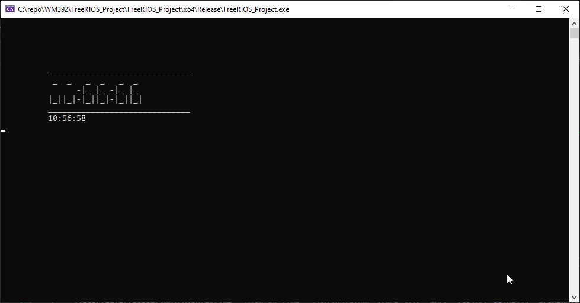

\newpage

# Abstract
The purpose of this document is to showcase and explain the logic behind the source code for WM392 Assigment 2. Part 1 contains all source code for Missions 1-3 and their explanations. Part 2 contains source code, system diagrams, and code analysis for a real-time digital dashboard from a vehicle.

\newpage

# Introduction


# Part 1
## Mission 1
### MVP
```c
void taskCalculateDateTime(void* pvParameters) {
    // initialise t variable of time type
    time_t t;
    // infinite loop
    while (1) {
        // get time once every second
        time(&t);
        // calculate local time and save to day time global struct
        localtime_s(&day_time, &t);
        // delay
        vTaskDelay(1000 / portTICK_PERIOD_MS);
    }
}
```

Using the `<time.h>`{.c} library, the current time and date since 1/1/1900 can be returned using `time()`{.c}. The using the `localtime_s()`{.c} function and saves it into the struct `day_time`{.c}.

```c
void taskPeriodicDisplayTime(void* pvParameters) {
    // initialise char array to display time
    char temp[256];
    // infinite loop
    while (1) {
        // create string to print to screen, get hour, minute, 
		// and second and print with 2 sig figs
        sprintf_s(temp, 255, "%02d:%02d:%02d\n", day_time.tm_hour, 
					day_time.tm_min, day_time.tm_sec);
        // print to (10,10)
        printXY(10, 10, temp);
        // delay
        vTaskDelay(1000 / portTICK_PERIOD_MS);
    }
    vTaskDelete(tkHandler1);
}
```

For each task that uses the `printXY()`{.c} function, a `temp`{.c} char array is definied to store the string being printed. An infinite loop is executed to continuously print the time to the user screen. `sprintf_s`{.c} is used to create a string a store it in the `temp`{.c} variable. Each element of time is accessed from the global `day_time`{.c} struct. 
Finally `vTaskDelay()`{.c} is used to ensure the task is executed once every second. 

```c
void taskPeriodicDisplayDate(void* pvParameters) {
	// initialise char array to display date
	char temp[256];
	// infinite loop
	while (1) {
		// if seconds == 00 then print date
		if (day_time.tm_sec == 0) {
			// create string to print to screen, get day, month and add 1 as it runs 
			// 0-11 not 1-12 and get year but add 1900 as it calculates years since then
			sprintf_s(temp, 255, "%d/%d/%d\n", day_time.tm_mday, 
					day_time.tm_mon + 1, day_time.tm_year + 1900);
			// print to (10,11)
			printXY(10, 11, temp);
			// wait 2 seconds
			vTaskDelay(2000 / portTICK_PERIOD_MS);
			// print empty string to (10,11) to clear date
			sprintf_s(temp, 255, "                          \n");
			printXY(10, 11, temp);
		}
	}
}
```

The date is displayed for two seconds every minute upon completion of every minute. The structure of the task follows the same as the previous tasks. By using an `if...else`{.c} selection statement to check if `day_time.tm_sec == 0`{.c} the application then forms a string using the same method as before to show the date for two seconds and then prints over the same location with an empty string after two seconds have elapsed. 


\newpage

### LED Extra
```c
// mapping for number to segments of display
const int digits[10][7] = {
	//    A, B, C, D, E, F, G
	/**/{ 1, 1, 1, 1, 1, 0, 0 },
		{ 0, 1, 1, 0, 0, 0, 0 },
		{ 1, 1, 0, 1, 1, 0, 1 },
		{ 1, 1, 1, 1, 0, 0, 1 },
		{ 0, 1, 1, 0, 0, 1, 1 },
		{ 1, 0, 1, 1, 0, 1, 1 },
		{ 1, 0, 1, 1, 1, 1, 1 },
		{ 1, 1, 1, 0, 0, 0, 0 },
		{ 1, 1, 1, 1, 1, 1, 1 },
		{ 1, 1, 1, 1, 0, 1, 1 }
};
```

The above multi-dimensional array is used to store the mapping from a digit to segments of a 7 segment display.

The `popDigit`{.c} function takes two parameters `digit`{.c} and `position`{.c}; where digit and position are the digit to be converted and the position to be placed in the LED display from 1 to 6 respectively.

```c
// define char array to show LED digits
char digit1[3][256] = { ' ' };
char digit2[3][256] = { ' ' };
char digit3[3][256] = { ' ' };
char digit4[3][256] = { ' ' };
char digit5[3][256] = { ' ' };
char digit6[3][256] = { ' ' };

void popDigit(int digit, int position) {
	// define output char array
	char out[3][256] = { ' ' };
	// for each segment
	for (int i = 0; i < 7; i++) {
		// check if requested digit needs the selected segment
		if (digits[digit][i] == 1) /* Has digit the i segment? */
			switch (i) {
			// fill positions in out char array
			case 0: out[0][1] = '_'; break; //A
			case 1: out[1][2] = '|'; break; //B
			case 2: out[2][2] = '|'; break; //C
			case 3: out[2][1] = '_'; break; //D
			case 4: out[2][0] = '|'; break; //E
			case 5: out[1][0] = '|'; break; //F
			case 6: out[1][1] = '_'; break; //G
			}
	}
```

The code above uses a for loop and the parameter `digit`{.c} to convert the chosen digit into a character array using the `digits`{.c} map that is defined above. 

```c
	// check position requested and fill corresponding digit array
	switch (position) {
		// if position
		case 1:
			// for each line in the out char array copy into the digit array 
			for (int i = 0; i < 3; i++) {
				strcpy(digit1[i], out[i]);
			}
			break;
		// if position
		case 2:
			// for each line in the out char array copy into the digit array 
			for (int i = 0; i < 3; i++) {
				strcpy(digit2[i], out[i]);
			}
			break;
		// if position
		case 3:
			// for each line in the out char array copy into the digit array 
			for (int i = 0; i < 3; i++) {
				strcpy(digit3[i], out[i]);
			}
			break;
		// if position
		case 4:
			// for each line in the out char array copy into the digit array 
			for (int i = 0; i < 3; i++) {
				strcpy(digit4[i], out[i]);
			}
			break;
		// if position
		case 5:
			// for each line in the out char array copy into the digit array 
			for (int i = 0; i < 3; i++) {
				strcpy(digit5[i], out[i]);
			}
			break;
		// if position
		case 6:
			// for each line in the out char array copy into the digit array 
			for (int i = 0; i < 3; i++) {
				strcpy(digit6[i], out[i]);
			}
			break;
	}
}
```

Using the parameter `position`{.c}, the converted char array is copied to the corresponding LED digit depending on what position was selected. The `popDigit()`{.c} function is then used in the task below.

```c
void taskPeriodicDisplayLEDTime(void* pvParameter) {
	// define padding char array
	char padding[256];
	// print a line of underscores to surround the LED display
	// this only needs to be printed once
	sprintf_s(padding, 255, "______________________________\n");
	printXY(10, 5, padding);
	printXY(10, 9, padding);
	// infinite loop
	while (1) {
		// empty output digits char array
		for (int i = 0; i < 3; i++) {
			for (int j = 0; j < 200; j++) {
				digit1[i][j] = ' ';
				digit2[i][j] = ' ';
				digit3[i][j] = ' ';
				digit4[i][j] = ' ';
				digit5[i][j] = ' ';
				digit6[i][j] = ' ';
			}
		}
		// get single digits from current time
		int hourDig1;
		hourDig1 = day_time.tm_hour / 10;
		// populate LED digit with the digit from above and put it in the correct position
		// for this example, it is the first hour digit so would be position 1/6
		// repeat this process for the rest of the digits
		popDigit(hourDig1, 1);
		int hourDig2;
		hourDig2 = day_time.tm_hour % 10;
		popDigit(hourDig2, 2);
		int minDig1;
		minDig1 = day_time.tm_min / 10;
		popDigit(minDig1, 3);
		int minDig2;
		minDig2 = day_time.tm_min % 10;
		popDigit(minDig2, 4);
		int secDig1;
		secDig1 = day_time.tm_sec / 10;
		popDigit(secDig1, 5);
		int secDig2;
		secDig2 = day_time.tm_sec % 10;
		popDigit(secDig2, 6);
```

The task above uses data from the `day_time`{.c} struct and the `popDigit()`{.c} function to display the time in an LED format once every second. Each iteration, the digits are cleared and recalculated using `popDigit()`{.c}.

```c
		// print the digits to the screen, 
		// i.e. position 0,1, and 2 of the digit char arrays
		printXY(10, 6, digit1[0]);
		printXY(10, 7, digit1[1]);
		printXY(10, 8, digit1[2]);
		printXY(13, 6, digit2[0]);
		printXY(13, 7, digit2[1]);
		printXY(13, 8, digit2[2]);
		// print gap between hour and minute
		printXY(16, 7, "-");
		printXY(16, 8, "-");
		printXY(17, 6, digit3[0]);
		printXY(17, 7, digit3[1]);
		printXY(17, 8, digit3[2]);
		printXY(20, 6, digit4[0]);
		printXY(20, 7, digit4[1]);
		printXY(20, 8, digit4[2]);
		// print gap between minute and second
		printXY(23, 7, "-");
		printXY(23, 8, "-");
		printXY(24, 6, digit5[0]);
		printXY(24, 7, digit5[1]);
		printXY(24, 8, digit5[2]);
		printXY(27, 6, digit6[0]);
		printXY(27, 7, digit6[1]);
		printXY(27, 8, digit6[2]);
		// delay 1 second
		vTaskDelay(1000 / portTICK_PERIOD_MS);
	}
}
```
Used in conjunction with the `popDigit()`{.c} function the above task displays 6 multi-dimensional character arrays which contain the a combination of '|' and '_' to display digits in the form of a segmented display. Using `printXY()`{.c} the application can strategically place the digits to display side by side and mimic and LED clock. 



\newpage

## Mission 2
### MVP
#### Periodic Display of Temperature
```c
int currentTemp;
int currentPressure;
int currentHumidity;

void taskGetWeather(void* pvParameter) {
    // infinite loop
    while (1) {
        // current temp = random int between 0 and 40
        currentTemp = rand() % 40;
        // current pressure is random int between 900 and 1200
        currentPressure = 900 + rand() % 300;
        // current humidity is random int between 0 and 100
        currentHumidity = rand() % 100;
    }
}
```

For the MVP (Minimum Viable Product) implementation, the app uses a random number generator to get values for temperature, pressure, and humidity. Using `rand() % X`{.c} we can get a random number between 0 and `X`{.c}. In the case of pressure, we have offset the value by 900 to give a realistic value.

```c
void taskPeriodicDisplayTemp(void* pvParameters) {
    // init char array
    char temp[256];
    // infinite loop
    while (1) {
        // if seconds == 10 then display temp
        if (day_time.tm_sec == 10) {
            sprintf_s(temp, 255, "Temp = %d%cC\n", currentTemp, 223);
            printXY(10, 12, temp);
            // wait 2 seconds
            vTaskDelay(2000 / portTICK_PERIOD_MS);
            sprintf_s(temp, 255, "                          \n");
            printXY(10, 12, temp);
        }
    }
}
```
To display the temperature periodically, the app follows the same template of creating a temporary char array and initialising an infinite loop. It then checks that the second value is equal to 10 and then prints the temperature to the display, below the date position, for 2 seconds.


\newpage

#### Periodic Display of Pressure
```c
void taskPeriodicDisplayPressure(void* pvParameters) {
    // init char array
    char temp[256];
    // infinite loop
    while (1) {
        // if seconds == 50 then display pressure
        if (day_time.tm_sec == 50) {
            sprintf_s(temp, 255, "Pressure = %dhPA\n", currentPressure);
            printXY(10, 12, temp);
            // wait 2 seconds
            vTaskDelay(2000 / portTICK_PERIOD_MS);
            sprintf_s(temp, 255, "                          \n");
            printXY(10, 12, temp);
        }
    }
}
```
To display the pressure periodically, the app follows the code as for temperature.


\newpage

#### Periodic Display of Humidity
```c
void taskPeriodicDisplayHumidity(void* pvParameters) {
    // init char array
    char temp[256];
    // infinite loop
    while (1) {
        // if seconds == 30 then display humidity
        if (day_time.tm_sec == 30) {
            sprintf_s(temp, 255, "Humidity = %d%%\n", currentHumidity);
            printXY(10, 12, temp);
            // wait 2 seconds
            vTaskDelay(2000 / portTICK_PERIOD_MS);
            sprintf_s(temp, 255, "                          \n");
            printXY(10, 12, temp);
        }
    }
}
```

To display the pressure humidity, the app follows the code as for temperature and pressure.


\newpage

### OpenWeatherMap API
```c
void taskGetAPIWeather(void* pvParameters) {
    CURL* hnd = curl_easy_init();

    curl_easy_setopt(hnd, CURLOPT_CUSTOMREQUEST, "GET");
    curl_easy_setopt(hnd, CURLOPT_URL, 
	"https://community-open-weather-map.p.rapidapi.com/weather?");

    struct curl_slist* headers = NULL;
    headers = curl_slist_append(headers, 
		"X-RapidAPI-Host: community-open-weather-map.p.rapidapi.com");
    headers = curl_slist_append(headers, 
		"X-RapidAPI-Key: 2172abc47bmshadab69c37af5e1ap181d88jsnb47e5db0a501");
    curl_easy_setopt(hnd, CURLOPT_HTTPHEADER, headers);

    CURLcode ret = curl_easy_perform(hnd);
    curl_easy_cleanup(hnd);
}
```
Using the libcurl library, the application can access the OpenWeatherMap API that has been created using their web service. It returns current weather data for the location given, in this case it is for Warwick. Finally we create `CURLcode`{.c} object to store the XML/JSON data returned from the API call to then extract later on to be used in the displayed of weather data.

\newpage

## Mission 3
```c
void taskEventManualDisplay(void* pvParameters) {
    // init char array to display the chosen metric
    char temp[256];
    // command variable to be input by user using keyboard T H or P
    int command;
    // infinite loop
    while (1) {
        // get input from user
        command = getch();
        // switch case statement - from T, H, P
        switch (command) {
        case 'T':
        case 't':
            // if T, then print currentTemp for 2 seconds
            sprintf_s(temp, 255, "Temp = %d%cC\n", currentTemp, 223);
            printXY(10, 12, temp);
            vTaskDelay(2000 / portTICK_PERIOD_MS);
            sprintf_s(temp, 255, "                          \n");
            printXY(10, 12, temp);
            break;
        case 'H':
        case 'h':
            // if H, then print currentHumidity for 2 seconds
            sprintf_s(temp, 255, "Humidity = %d%%\n", currentHumidity);
            printXY(10, 12, temp);
            vTaskDelay(2000 / portTICK_PERIOD_MS);
            sprintf_s(temp, 255, "                          \n");
            printXY(10, 12, temp);
            break;
        case 'P':
        case 'p':
            // if P, then print currentPRessure for 2 seconds
            sprintf_s(temp, 255, "Pressure = %dhPA\n", currentPressure);
            printXY(10, 12, temp);
            vTaskDelay(2000 / portTICK_PERIOD_MS);
            sprintf_s(temp, 255, "                          \n");
            printXY(10, 12, temp);
            break;
        }
    }
}
```

Using a temp char array again, the application will print out either the temperature, humidity or pressure, on demand. Using the `getch()`{.c} function, the application can monitor user keystrokes without the need for enter being pressed and can act accordingly when a key is pressed. In this case we look for 't', 'T', 'h', 'H', 'p', and 'P' and respond with the corresponding weather metric and display it for 2 seconds. 

\newpage


\newpage

## Main Function
```c
int main(void) {
    xTaskCreate(taskPeriodicDisplayLEDTime, "Display_LED", 
		configMINIMAL_STACK_SIZE, NULL, tskIDLE_PRIORITY, NULL);
    xTaskCreate(taskGetRandomWeather, "Get_Weather", 
		configMINIMAL_STACK_SIZE, NULL, tskIDLE_PRIORITY, NULL);
    xTaskCreate(taskCalculateDateTime, "Calc_Date_Time", 
		configMINIMAL_STACK_SIZE, NULL, tskIDLE_PRIORITY, NULL);
    xTaskCreate(taskPeriodicDisplayTime, "Display_Time", 
		configMINIMAL_STACK_SIZE, NULL, tskIDLE_PRIORITY, &tkHandler1);
    xTaskCreate(taskPeriodicDisplayDate, "Display_Date", 
		configMINIMAL_STACK_SIZE, NULL, tskIDLE_PRIORITY, NULL);
    xTaskCreate(taskPeriodicDisplayTemp, "Display_Temp", 
		configMINIMAL_STACK_SIZE, NULL, tskIDLE_PRIORITY, NULL);
    xTaskCreate(taskPeriodicDisplayHumidity, "Display_Humidity", 
		configMINIMAL_STACK_SIZE, NULL, tskIDLE_PRIORITY, NULL);
    xTaskCreate(taskPeriodicDisplayPressure, "Display_Pressure", 
		configMINIMAL_STACK_SIZE, NULL, tskIDLE_PRIORITY, NULL);
    xTaskCreate(taskEventManualDisplay, "Display_Pressure", 
		configMINIMAL_STACK_SIZE, NULL, tskIDLE_PRIORITY, NULL);
    vTaskStartScheduler();
    for (;;);
}
```

The main function contains numerous calls to `xTaskCreate()`{.c}. Each call links each function that is created in the file to a task in the OS and then allows the scheduler to allocate CPU time to it. Each task has the same priority, and the manual display tasks will take priority when a key is pressed.

\newpage

# Part 2
## Description
The purpose of this application is to emulate a vehicle dashboard showing vehicle speed, ambient temperature, vehicle mileage, and changing of gear. When changing from accelerating past 10, 30, 40, 50, 60 and 70 MPH, the application shall increment the gear and display that to the user. The reverse shall happen during deceleration. 

When no key is being pressed, the application shall simulate engine breaking, and reduce speed automatically. 

The application shall comprise itself of the following:

- 12 Tasks
	- 1 Event Driven
	- 11 Periodic
- 2 Protected Race Conditions 
	- 1 Using Semaphores
	- 1 Using Suspension Of Tasks
- Simulated 3rd Party Data

## Application Architecture

## Code Analysis
### Logo Display
```c
// char arrays to display logos
char line0[256] = { ' ', '_', '_', '_', '_', '_', '_', '_', '_', '_', '_', ' ', ' ', ' ', ' ' };
char line1[256] = { '/', ' ', ' ', ' ', ' ', ' ', ' ', ' ', ' ', ' ', ' ', '\\', ' ', ' ', ' ' };
char line2[256] = { '|', ' ', ' ', 'J', 'a', 'g', 'u', 'a', 'r', ' ', ' ', '|', ' ', ' ', ' ', ' ' };
char line3[256] = { '\\', '_', '_', '_', '_', '_', '_', '_', '_', '_', '_', '/', ' ', ' ', ' ' };

char line4[256] = { ' ', '_', '_', '_', '_', '_', '_', '_', '_', '_', '_', ' ', ' ', ' ', ' ' };
char line5[256] = { '/', ' ', ' ', ' ', ' ', ' ', ' ', ' ', ' ', ' ', ' ', '\\', ' ', ' ', ' ' };
char line6[256] = { '|', 'L', 'a', 'n', 'd', ' ', 'R', 'o', 'v', 'e', 'r', '|', ' ', ' ', ' ', ' ' };
char line7[256] = { '\\', '_', '_', '_', '_', '_', '_', '_', '_', '_', '_', '/', ' ', ' ', ' ' };
```


### Global Variables
```c
// global variables
struct tm day_time;
int currentTemp;
int currentSpeed;
int currentPressure;
int currentHumidity
int command;
```

### Weather Calculation & Display


```c
void taskGeRandomtWeather(void* pvParameter) {
	// infinite loop
	while (1) {
		// current temp = random int between 0 and 40
		currentTemp = rand() % 40;
		// current pressure is random int between 900 and 1200
		currentPressure = 900 + rand() % 300;
		// current humidity is random int between 0 and 100
		currentHumidity = rand() % 100;
	}
}
```

The code snippet below, can be used in place of the code above to get real-time weather data from an API. Using the libcurl library, the application can access the OpenWeatherMap API that has been created using their web service. It returns current weather data for the location given, in this case it is for Warwick. Finally we create `CURLcode`{.c} object to store the XML/JSON data returned from the API call to then extract later on to be used in the displayed of weather data.
```c
void taskGetAPIWeather(void* pvParameters) {
    CURL* hnd = curl_easy_init();

    curl_easy_setopt(hnd, CURLOPT_CUSTOMREQUEST, "GET");
    curl_easy_setopt(hnd, CURLOPT_URL, 
	"https://community-open-weather-map.p.rapidapi.com/weather?");

    struct curl_slist* headers = NULL;
    headers = curl_slist_append(headers, 
		"X-RapidAPI-Host: community-open-weather-map.p.rapidapi.com");
    headers = curl_slist_append(headers, 
		"X-RapidAPI-Key: 2172abc47bmshadab69c37af5e1ap181d88jsnb47e5db0a501");
    curl_easy_setopt(hnd, CURLOPT_HTTPHEADER, headers);

    CURLcode ret = curl_easy_perform(hnd);
    curl_easy_cleanup(hnd);
}
```

```c
void taskPeriodicDisplayTemp(void* pvParameters) {
	// init char array
	char temp[256];
	// infinite loop
	while (1) {
		sprintf_s(temp, 255, "%d%cC   \n", currentTemp, 223);
		printXY(1, 2, temp);
		vTaskDelay(1000 / portTICK_PERIOD_MS);
	}
}
```

### Date/Time Display
```c
void taskCalculateDateTime(void* pvParameters) {
	// initialise t variable of time type
	time_t t;
	// infinite loop
	while (1) {
		// get time once every second
		time(&t);
		// calculate local time and save to day time global struct
		localtime_s(&day_time, &t);
		// delay
		vTaskDelay(1000 / portTICK_PERIOD_MS);
	}
}

void taskPeriodicDisplayTime(void* pvParameters) {
	// initialise char array to display time
	char temp[256];
	// infinite loop
	while (1) {
		// create string to print to screen, get hour, minute, and second and print with 2 sig figs
		sprintf_s(temp, 255, "%02d:%02d:%02d\n", day_time.tm_hour, day_time.tm_min, day_time.tm_sec);
		// print to (10,10)
		printXY(1, 1, temp);
		// delay
		vTaskDelay(1000 / portTICK_PERIOD_MS);
	}
	vTaskDelete(tkHandler1);
}

void taskPeriodicDisplayDate(void* pvParameters) {
	// initialise char array to display date
	char temp[256];
	// infinite loop
	while (1) {
		// create string to print to screen, get day, month and add 1 as it runs 0-11 not 1-12 and get year but add 1900 as it calculates years since then
		sprintf_s(temp, 255, "%d/%d/%d\n", day_time.tm_mday, day_time.tm_mon + 1, day_time.tm_year + 1900);
		// print to (10,11)
		printXY(110, 1, temp);
		vTaskDelay(1000 / portTICK_PERIOD_MS);
	}
}
```

### Speed Control (Event & Periodic)

```c
// function to simulate engine braking i.e. speed decreasing when not on accelerator
void taskSimEngineBraking(void* pvParameters) {
	while (1) {
		if (command == 0) { 
			// if there is no user input
			if (speedSemaphore != NULL && currentSpeed > 0) {
				// if semaphore exists and current speed is greater than 0
				/* See if we can obtain the semaphore.  If the semaphore is not
				available wait 10 ticks to see if it becomes free. */
				if (xSemaphoreTake(speedSemaphore, (TickType_t)500) == pdTRUE) {
					// decrement speed
					currentSpeed--;
					// return semaphore
					xSemaphoreGive(speedSemaphore);
				}
				else {
					/* We could not obtain the semaphore and can therefore not access
					the shared resource safely. */
					// return semaphore
					xSemaphoreGive(speedSemaphore);
				}
			}
		}
		// delay task
		vTaskDelay(350 / portTICK_PERIOD_MS);
	}
}
```

```c
void taskEventManualSpeed(void* pvParameters) {
	// init char array to display the chosen metric
	// infinite loop
	while (1) {
		// get input from user
		command = getch();
		// if commmand is to accelerate
		if (command == 'w') {
			if (speedSemaphore != NULL) {
				/* See if we can obtain the semaphore.  If the semaphore is not
				available wait 10 ticks to see if it becomes free. */
				if (xSemaphoreTake(speedSemaphore, (TickType_t)100) == pdTRUE) {
					// increment speed
					currentSpeed++;
					// return semaphore
					xSemaphoreGive(speedSemaphore);
					// reset command
					command = 0;
				}
				else {
					/* We could not obtain the semaphore and can therefore not access
					the shared resource safely. */
					// reset command
					command = 0;
					// return semaphore
					xSemaphoreGive(speedSemaphore);
				}
			}
		}
		// if command is decelerate
		else if (command == 's' && currentSpeed > 0) {
			if (speedSemaphore != NULL) {
				/* See if we can obtain the semaphore.  If the semaphore is not
				available wait 10 ticks to see if it becomes free. */
				if (xSemaphoreTake(speedSemaphore, (TickType_t)100) == pdTRUE) {
					// decrement speed
					currentSpeed--;
					// return semaphore
					xSemaphoreGive(speedSemaphore);
					// reset command
					command = 0;
				}
				else {
					/* We could not obtain the semaphore and can therefore not access
					the shared resource safely. */
					// reset command
					command = 0;
					// return semaphore
					xSemaphoreGive(speedSemaphore);
				}
			}
		}
		else {
			command = 0;
		}
		vTaskDelay(100 / portTICK_PERIOD_MS);
	}
}
```

```c
void taskDisplaySpeed(void* pvParameters) {
	// task to display speed
	// temp char array
	char temp[256];
	while (1) {
		// continuously display speed from shared resource currentSpeed
		sprintf_s(temp, 255, "%d MPH   \n", currentSpeed);
		printXY(50, 10, temp);
		vTaskDelay(100 / portTICK_PERIOD_MS);
	}
}
```

\newpage

# References